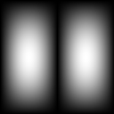
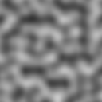
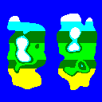

# cogni: Manage Computed Values and Their Dependencies

`cogni` is a TypeScript utility for efficient management of computed values in dependency trees, ideal for scenarios like game development and dynamic content generation. It minimizes redundant computations, ensuring compute functions are called as needed.

- **Version:** 1.1.3

## Key Features
- **Efficient Dependency Management**: Streamlines the management of computed values in dependency trees.
- **Asynchronous Support**: [`cogniAsync`](API-reference.md#cogniasync) extension accommodates asynchronous compute functions, allowing for handling of operations that depend on asynchronous data sources or processes.
- **Memoization Utility**: [`cogniMemo`](API-reference.md#cognimemo) is a powerful memoization feature to optimize performance by caching and reusing results of expensive function calls.

## Installation

Ensure Node.js, and optionally TypeScript, are set up before installing `cogni`. Install using npm or yarn:

```sh
npm install cogni
# or
yarn add cogni
```

## Examples

### Example 1: Hello World

This example shows how to define and use compute functions with `cogni`, using [`define`](API-reference.md#api-reference) for creating computation nodes and [`get`](API-reference.md#api-reference) for retrieving results.

```typescript
import cogni from 'cogni';

// Define 'Params' type to specify the input parameters for your compute functions.
// In this example, our compute functions will expect two parameters: 'greeting' and 'recipient'.
type Params = {
  readonly greeting: string;
  readonly recipient: string;
};

// Define 'Results' type to specify the structure of the output from your compute functions.
// Here, we only have one computed value, 'output', which will be a string.
type Results = {
  output: string;
};

// Initialize a new computation tree with the specified 'Params' and 'Results' types.
// This sets up the structure for your computation graph, allowing cogni to manage dependencies and computations effectively.
const { define, get } = cogni<Params, Results>();

// Define a computation node in the tree.
// Here, 'output' is a computed value that concatenates the 'greeting' and 'recipient' parameters.
define('output', ({ greeting, recipient }) => `${greeting} ${recipient}!`);

// Retrieve the computed value 'output' from the tree by providing the necessary parameters.
// 'get' executes the computation and returns the result based on the input parameters.
const output = get('output', {
  greeting: 'Hello',
  recipient: 'World',
});

console.log(output); // Hello World!
```

### Example 2: Inheritance

This example illustrates how computed values can be derived from other computations, demonstrating `cogni`'s handling of hierarchical data dependencies.

```typescript
// Define input parameters for the computation tree.
// In this example, we have three numerical parameters.
type Params = {
  readonly param1: number;
  readonly param2: number;
  readonly param3: number;
};

// Define the structure for the computed results.
// This includes values computed at different levels of the tree.
type Results = {
  parentValue: number;
  child1: number;
  child2: number;
  root: number;
};

const { define, get } = cogni<Params, Results>();

// Define a parent node in the computation tree.
// 'parentValue' is computed using 'param1' and 'param2'.
define(
  'parentValue',
  ({ param1, param2 }) => param1 * param2,
)

// 'child1' is a child node that derives its value from 'parentValue', illustrating how nodes can inherit and transform data from parent nodes.
define(
  'child1',
  ({ param1 }, { parentValue }) => parentValue * 2 - param1,
  ['parentValue'],
)

// Another child node dependent on 'parentValue'.
// 'child2' computes a value based on 'parentValue' and 'param2'.
define(
  'child2',
  ({ param2 }, { parentValue }) => parentValue / 2 + param2,
  ['parentValue'],
)

// Define the root node of the tree, depending on both child nodes.
// 'root' computes its value based on 'child1', 'child2', and 'param3'.
define(
  'root',
  ({ param3 }, { child1, child2 }) => child1 * child2 + param3,
  ['child1', 'child2'],
);

// Retrieve the computed value at the root of the tree.
const value = get('root', {
  param1: 4,
  param2: 2,
  param3: -30,
});

console.log(`The meaning of life, the universe, and everything is ${value}`); // 42
```

### Example 3: World Generator

The World Generator example showcases cogni's prowess in procedural content generation. Here, we create a dynamic map where each compute function plays a role in shaping the landscape, demonstrated through our step-by-step visual renderings.

This example demonstrates the use of [`getMany`](API-reference.md#api-reference) for retrieving multiple computed values simultaneously, as opposed to using [`get`](API-reference.md#api-reference) for individual values. It showcases `cogni` in a scenario of procedural content generation, utilizing [`simplex-noise`](https://www.npmjs.com/package/simplex-noise) and multiple computation functions to create a world generator.

```typescript
import { createNoise2D } from 'simplex-noise';

// Gradient noise function for organic shapes.
const noise2D = createNoise2D();

// Parameters for the world generation, including coordinates (x, y) ranging from 0.0 to 1.0 for scalability.
type WorldGenParams = {
  readonly x: number;
  readonly y: number;
  readonly noise2D: (x: number, y: number) => number;
  readonly noiseScale: number;
};

// Result structure for world generation computations.
type WorldGenResults = {
  continentShape: number;
  heightNoise: number;
  height: number;
  temperature: number;
  precipitation: number;
  biome: string;
};

const { define, getMany } = cogni<WorldGenParams, WorldGenResults>();
```

Now that we've defined our parameters and results, we can start defining the functions that sculpt the world.

```typescript
// Define the continent shape based on x and y coordinates.
// This creates two continents horiontally that span the height of the world.
define('continentShape', ({ x, y }) =>
  Math.abs(Math.cos(x * Math.PI * 2 + Math.PI * 0.5) * Math.sin(y * Math.PI)));
```


```typescript
// Compute the height noise using the provided noise function and scale.
define('heightNoise',
  ({ x, y, noiseScale, noise2D }) =>
    noise2D(x * noiseScale, y * noiseScale) * 0.5 + 0.5); // Normalize to 0...1
```


```typescript
// Calculate the height by combining continent shape and height noise to produce the final height value.
// Notice that it does not use any parameters, only the results from the previous computations.
define('height',
  (params, { continentShape, heightNoise }) =>
    continentShape * heightNoise,
  ['continentShape', 'heightNoise']);
```


```typescript
// Define temperature, factoring in height and latitude (y-coordinate).
// North is cold, South is hot, and peaks are covered in frost.
define('temperature',
  ({ y }, { height }) =>
    (height > 0.4 ? y - (height - 0.4) * 2 : y),
  ['height']);
```


```typescript
// Determine precipitation based on temperature.
// Hotter areas have less rainfall.
define('precipitation',
  (params, { temperature }) =>
    1 - temperature,
  ['temperature']);
```


```typescript
// Determines the 'biome' based on 'height', 'temperature', and 'precipitation', influenced by the 'x' and 'y' coordinates from the parent nodes.
define('biome',
  (params, { height, temperature, precipitation }) => {
    if (height < 0.2023) return 'ocean';
    if (temperature >= 0.666) return 'desert';
    if (temperature > 0.42 && precipitation > 0.42) return 'rainforest';
    if (temperature > 0.3 && precipitation > 0.3) return 'forest';
    if (temperature <= 0.21) return 'tundra';
    return 'meadows';
  },
  ['height', 'temperature', 'precipitation']);
```


```typescript
// Retrieve sample values within the 0.0 to 1.0 range for a random location.
const sample = getMany(
  ['height', 'biome', 'precipitation', 'temperature'],
  {
    x: Math.random(),
    y: Math.random(),
    noiseScale: 8,
    noise2D
  });

const biomeMessage = sample.biome === 'ocean'
  ? 'I am sailing the ocean.'
  : `I am exploring in the ${sample.biome}.`;

// It's a surprise!
console.log(biomeMessage);
```

## Using `cogniAsync` for Asynchronous Computations

### Example 4: Asynchronous Dependency Computations

Here, we demonstrate how [`cogniAsync`](API-reference.md#cogniasync) handles asynchronous compute functions, useful for scenarios involving async data fetching or processing.

```typescript
import cogniAsync from 'cogni/async';

// Initialize cogniAsync for asynchronous operations.
const { define, get } = cogniAsync<{ base: number }, { double: number, triple: number }>();

// Asynchronously double the input.
define('double', async ({ base }) => {
  return new Promise(resolve => setTimeout(() => resolve(base * 2), 1000));
});

// Asynchronously triple the input.
define('triple', async ({ base }) => base * 3);

// Function to perform and log async computations.
async function performAsyncComputations() {
  try {
    const doubleResult = await get('double', { base: 2 });
    console.log('Double:', doubleResult);

    const tripleResult = await get('triple', { base: 3 });
    console.log('Triple:', tripleResult);
  } catch (error) {
    console.error('An error occurred:', error);
  }
}

performAsyncComputations();
```

In this example, [`cogniAsync`](API-reference.md#cogniasync) enables the definition and execution of asynchronous compute functions, seamlessly integrating asynchronous operations into your computation graph.

## Using `cogniMemo` for Memoization

### Example 5: Memoizing Computation Results

This example demonstrates the use of [`cogniMemo`](API-reference.md#cognimemo) to cache and reuse computation results, significantly improving performance for repeat calculations.

```typescript
import cogni from 'cogni';
import { MemoryStorage, cogniMemoGet } from 'cogni/memo';

// Initialize cogni with parameter and result types.
const { define, get } = cogni<{ a: number }, { double: number }>();

// Define a computation function.
define('double', ({ a }) => a * 2);

// Create a memory storage for caching.
const storage = new MemoryStorage<string, number>();

// Memoize the 'double' computation.
const memoizedDouble = cogniMemoGet(get, 'double', ['a'], {}, storage);

// Function to demonstrate memoization.
async function computeAndCache() {
  // Compute 'double' for the first time.
  const firstResult = await memoizedDouble({ a: 2 });
  console.log('First call (computed):', firstResult);

  // Second call should fetch from cache.
  const secondResult = await memoizedDouble({ a: 2 });
  console.log('Second call (cached):', secondResult);
}

computeAndCache();

```

This example illustrates how [`cogniMemo`](API-reference.md#cognimemo) can be used to memoize the results of compute functions, reducing computational overhead for repeated calls with the same parameters.

## Detailed API Reference
For a comprehensive understanding of all the functionalities, types, and methods available in cogni, please refer to the [API Reference](API-reference.md).

## License

This project is licensed under the [MIT License](https://opensource.org/license/mit/).
