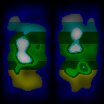

# Gen3: Efficient Computation of Interdependent Values

`Gen3` is a powerful TypeScript library designed to efficiently manage and compute interdependent values within a tree hierarchy. By defining a series of compute functions that can depend on each other, making it simple and intuitive to calculate values that rely on multiple inputs and previous computations.

Efficiency is a core principle in the design of this library. When you request a result by invoking a compute function, the library ensures that each function is called just once, regardless of how many other compute functions depend on its output. This not only conserves computational resources but also ensures consistent results across the tree hierarchy.

This design choice allows for complex compositions of compute functions without the worry of redundant calculations, leading to faster and more predictable outcomes.

## Features:

- **Interdependent Computation**: Easily define and manage values that depend on other computed values.
- **Chaining**: Define compute functions and retrieve their values in a chainable manner.
- **Highly Customizable**: Tailored to work with custom parameter types and result types.
- **Type Safety**: Written in TypeScript, ensuring type safety and improved developer experience.

## Installation:

```sh
npm install gen3
```

## Usage

### Example 1: Hello World

Create a single compute function that takes two parameters.

```js
import Gen3 from 'gen3';

const gen = new Gen3();

gen.define('output', ({ greeting, recipient }) => `${greeting} ${recipient}!`);

const output = gen.get('output', { greeting: 'Hello', recipient: 'World' }); 
console.log(output); // Hello World!
```

### Example 2: Inheritance

Compute values based on the results from parent compute functions.

```js
const gen = new Gen3();

// parentValue uses both value1 and value2 parameters
gen.define('parentValue', ({ value1, value2 })
=> value1 * value2);

// child1 uses value1 parameter, and the parentValue
gen.define('child1', ({ value1, parent: { parentValue } })
=> parentValue * 2 - value1,
  ['parentValue']);

// child2 uses value2 parameter, and the parentValue
gen.define('child2', ({ value2, parent: { parentValue } })
=> parentValue / 2 + value2,
  ['parentValue']);

// root uses someValue parameter, and parents child1 and child2
gen.define('root', ({ someValue, parent: { child1, child2 } })
=> child1 * child2 + someValue,
  ['child1', 'child2']);

const value = gen.get('root', { value1: 4, value2: 2, someValue: -30 });
console.log(`The meaning of life, the universe, and everything is ${value}`);
```

### Example 3: World Generator

To demonstrate the power of `Gen3`, lets build a basic world generator using multiple compute functions.

A preview of the generated values follows each `define` call.

```js
import Gen3 from 'gen3';
import { createNoise2D } from 'simplex-noise';

const worldGen = new Gen3();
```

```js
// We want two continents horiontally spanning the height of the world
worldGen.define('continentShape', ({ x, y })
=> Math.abs(Math.cos(x * Math.PI * 2 + Math.PI * 0.5) * Math.sin(y * Math.PI)));
```


```js
// Adding gradient noise makes the world less flat
worldGen.define('heightNoise', ({ x, y, noiseScale, noise2D })
=> noise2D(x * noiseScale, y * noiseScale) * 0.5 + 0.5);
```


```js
// Combine continent shape and height noise
worldGen.define('height', ({ parent: { continentShape, heightNoise } })
=> continentShape * heightNoise,
  ['continentShape', 'heightNoise']);
```


```js
// North is cold, and South is hot, and peaks are covered in frost
worldGen.define('temperature', ({ x, y, parent: { height } })
=> height > 0.4 ? y - (height - 0.4) * 2 : y,
  ['height']);
```


```js
// Hotter areas have less rainfall
worldGen.define('precipitation', ({ parent: { temperature } })
=> 1 - temperature,
  ['temperature']);
```


```js
// Height, temperature and precipitation are used to calculate the biome
worldGen.define('biome', ({ parent: { height, temperature, precipitation } })
=> {
  if (height < 0.2023) return 'ocean';
  if (temperature >= 0.666) return 'desert';
  if (temperature > 0.42 && precipitation > 0.42) return 'rainforest';
  if (temperature > 0.3 && precipitation > 0.3) return 'forest';
  if (temperature <= 0.21) return 'tundra';
  return 'meadows';
}, ['height', 'temperature', 'precipitation']);
```


```js
// The final sample returns the height and biome
worldGen.define('sample', ({ parent: { height, biome } })
=> ({ height, biome }),
  ['height', 'biome']);
```


```js
// The world is ready to be sampled
const { height, biome } = worldGen.get('sample', {
  x: 0.5,
  y: 0.5,
  noiseScale: 64,
  noise2D
});
```

## TypeScript Examples

Explore the following TypeScript examples to get a better understanding of how `Gen3` can be used:

- [Hello World!](examples/hello-world.ts)
- [Inheritance](examples/inheritance.ts)
- [World Generator](examples/world-generator.ts)

## License

This project is licensed under the MIT License. 
